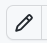

# Editing the materials on GitHub

Through the power of GitHub, any one can make changes to this material. 

- Choose which file you wish to edit, e.g. [https://github.com/UCL/SODA/blob/main/mapping-visualisation-social-data/manual-qgis.qmd](https://github.com/UCL/SODA/blob/main/mapping-visualisation-social-data/manual-qgis.qmd)

- You will need to log in with your GitHub account, or create one if you don't have one. 

- Click on the pencil icon **Edit this file** in the top left corner: 

- Make your changes *the website is written in Quarto - it should be fairly easy to read!*

- Click **Commit changes...** 

- By default, you will be asked to **Create a new branch for this commit and start a pull request**. 

- Type in a little note explaining what you have changed and click **Propose changes**.  

- This will create a **Pull Request** which someone will review. 

- Thanks very much!

For more info on Git & GitHub, have a look at [http://archaeogeek.github.io/foss4gukdontbeafraid/](http://archaeogeek.github.io/foss4gukdontbeafraid/). 
