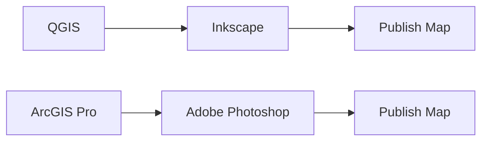

## Flowchart for Lesson 7: Cartography using Inkscape

Written in [Mermaid](https://docs.github.com/en/get-started/writing-on-github/working-with-advanced-formatting/creating-diagrams). Can edit code in interactive editor at [mermaid.live](mermaid.live).

Exported to PNG [here](images/mermaid-flowchart.png). 
